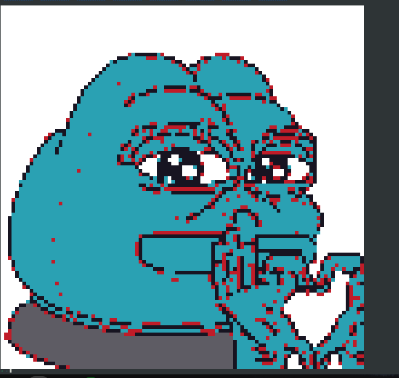

# Pikslate
simple cli app that pixelates and draws a given image on the terminal. 

# Building and running
after successfully cloning and loading the project you can run the following gradle task
to build binaries.

```bash
./gradlew installDist
```

this will generate an executable at ``Pikslate/build/install/Pikslate/bin`` then you can just
do
```bash
./Pikslate --url=/path/to/your/image --height=100 --width=100
```

# Note
make sure to zoom out as much as possible in your terminal. also, program is tested with only .png, .jpg and
.jpeg files. (see ``/images`` folder for samples)

# Preview
pepe_love.png

napoleon.jpg

The_GNU_logo.png

hard_smile.jpg


# Resolution
you can optionally ``--height`` or ``--width`` args. but this is of course limited by the amount of
characters you can put in your terminal.

# Accuracy
I have tried my best to make the ``getDistance()`` function as accurate as possible with the help of
stackoverflow and Chat-GPT. but it is still very hard because Mosaic by default supports a few ANSI bash
colors. see implementation [here.](https://github.com/JakeWharton/mosaic/blob/trunk/mosaic-runtime/src/commonMain/kotlin/com/jakewharton/mosaic/ui/Color.kt) 

Extending and overriding is not possible since the Colors class is private by default. in the future
I will (hopefully) fork it and add colors for better images. 

# Algorithms
I have quickly hacked up things that I could find in stackoverflow, old blogs and GPT. after experimenting with many
algorithms, I have found the implementation in ``getDominantColor()`` function heavily affects the color
selection process. so better ideas are appreciated.

# Performance
seems like it performs worse in detailed images and better with images that are mono-chromed or contain
fewer colors.